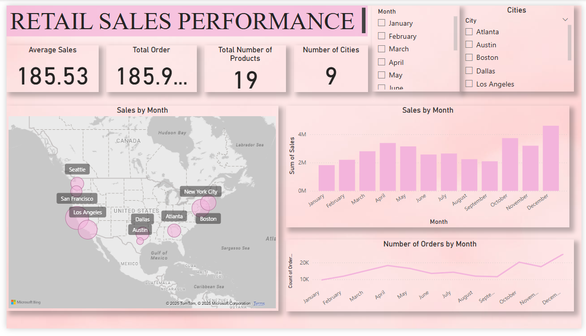
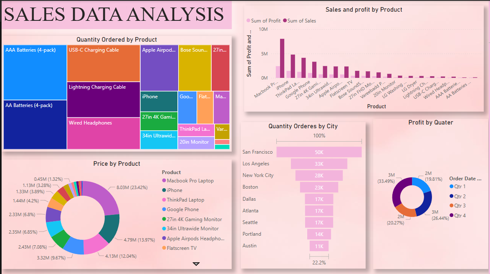

# 📊 Sales Data Analysis

Welcome to the **Sales Data Analysis** project! This repository contains a comprehensive analysis of retail sales data using Microsoft Power BI
---

## 🔍 Project Overview

The objective of this project is to:

1. Ingest and clean raw sales data  
2. Explore trends in monthly, city‑level and product‑level performance  
3. Build interactive dashboards to visualize key metrics  
4. Deliver actionable insights to inform marketing and inventory decisions

---

## 🧾 Dataset

- **Filename:** `Sales Data.csv`  
- **Fields include:**  
  - `Order ID`  
  - `Order Date`  
  - `Product`  
  - `Quantity Ordered`  
  - `Price Each`  
  - `Purchase Address`  

These fields have been used to answer business questions such as:

- Which month shows the highest revenue?  
- Which city generates the most orders?  
- What are peak times for placing orders?  
- Which products are most frequently sold together?

---

## 🧪 Analysis Workflow

1. **Data Import**  
   - Loaded `Sales Data.csv` into Power BI Desktop.  
2. **Data Cleaning**  
   - Removed duplicate and null rows.  
   - Parsed `Order Date` into Year, Month and Hour columns.  
   - Extracted city names from `Purchase Address`.  
3. **Modeling & Relationships**  
   - Created simple star schema (Fact: Sales; Dimensions: Date, City, Product).  
4. **Visualization**  
   - Monthly revenue trend (line chart)  
   - City‑wise order volume (choropleth map)  
   - Hour‑of‑day order heatmap  
   - “Frequently bought together” product analysis (matrix visual)  
5. **Export**  
   - Published interactive `.pbix` file.  
   - Exported a static PDF (`Sales data analysis.pdf`) for sharing.

---

## 📂 Repository Structure

